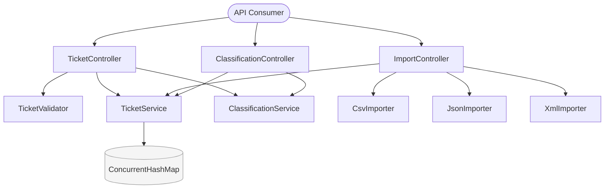

# Homework 2: Intelligent Customer Support Ticket Management System

## Overview

A comprehensive Spring Boot REST API for managing customer support tickets with multi-format import capabilities, automatic categorization, and priority assignment. The system handles ticket lifecycle management, bulk file imports (CSV/JSON/XML), and intelligent classification based on content analysis.

**Key Features:**
- ✅ CRUD operations for support tickets
- ✅ Multi-format ticket import (CSV, JSON, XML)
- ✅ Automatic ticket categorization using keyword matching
- ✅ Intelligent priority assignment
- ✅ Auto-classification on ticket creation (`?auto_classify=true`)
- ✅ Advanced filtering and search
- ✅ Comprehensive test suite (85%+ coverage, 320+ tests)
- ✅ Health check via Spring Actuator (`/actuator/health`)

---

## Architecture



Full diagrams: [`docs/DIAGRAMS.md`](docs/DIAGRAMS.md) — architecture, ticket lifecycle, request flows, data model.

---

## Technology Stack

| Layer | Technology |
|-------|-----------|
| **Language** | Kotlin 1.9.22 |
| **Framework** | Spring Boot 3.2.0 |
| **Build Tool** | Gradle 8.x |
| **Testing** | JUnit 5, AssertJ, Mockk |
| **Code Quality** | Spotless, ktlint 0.50.0 |
| **File Parsing** | Apache Commons CSV, Jackson |
| **JDK** | Java 17+ |

---

## Setup & Installation

### Prerequisites

- Java 17+
- Gradle 8.x

### Build

```bash
./gradlew clean build
```

### Run Application

```bash
./gradlew :homework-2:bootRun
```

Application starts on `http://localhost:8080`

### Run Tests

```bash
./gradlew :homework-2:test
```

---

## API Endpoints

| Method | Endpoint | Description |
|--------|----------|-------------|
| `POST` | `/tickets` | Create ticket (`?auto_classify=true` for inline classification) |
| `GET` | `/tickets` | List tickets (filter: `customer_id`, `status`, `category`, `priority`) |
| `GET` | `/tickets/{id}` | Get ticket |
| `PUT` | `/tickets/{id}` | Update ticket (partial) |
| `DELETE` | `/tickets/{id}` | Delete ticket |
| `POST` | `/tickets/import` | Bulk import from CSV / JSON / XML |
| `POST` | `/tickets/{id}/auto-classify` | Classify existing ticket |
| `GET` | `/actuator/health` | Health check |

Full request/response schemas and cURL examples: [`docs/API_REFERENCE.md`](docs/API_REFERENCE.md)

**Sample Data**: Pre-built test data in `demo/` — see [`docs/SAMPLE_DATA_SETUP.md`](docs/SAMPLE_DATA_SETUP.md) for import instructions

---

## Project Structure

```
homework-2/
├── src/main/kotlin/com/ai/homework/
│   ├── controller/     # REST endpoints (Ticket, Import, Classification)
│   ├── service/        # Business logic (TicketService, ClassificationService)
│   ├── importer/       # File parsers (CSV, JSON, XML)
│   ├── validator/      # Input validation
│   ├── model/          # Domain classes and enums
│   └── dto/            # Request/Response DTOs
├── src/test/kotlin/    # 320+ tests (unit + integration)
├── src/test/resources/fixtures/  # Test data fixtures
├── demo/               # Sample data files (50 CSV, 20 JSON, 30 XML + invalid)
├── docs/
│   ├── API_REFERENCE.md    # All endpoints with cURL examples
│   ├── ARCHITECTURE.md     # C4 diagrams + design decisions
│   ├── DIAGRAMS.md         # All Mermaid diagrams
│   └── TESTING_GUIDE.md    # Coverage breakdown, how to run, benchmarks
└── HOWTORUN.md         # Step-by-step run + all API examples
```

<div align="center">

*This project was completed as part of the AI-Assisted Development course.*

</div>
