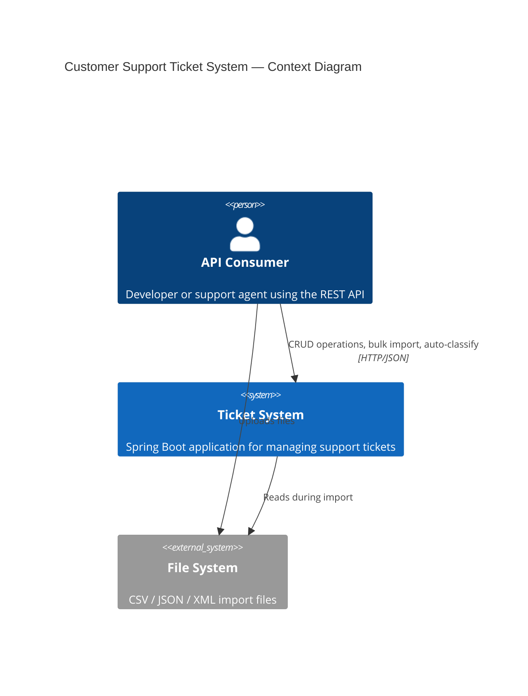
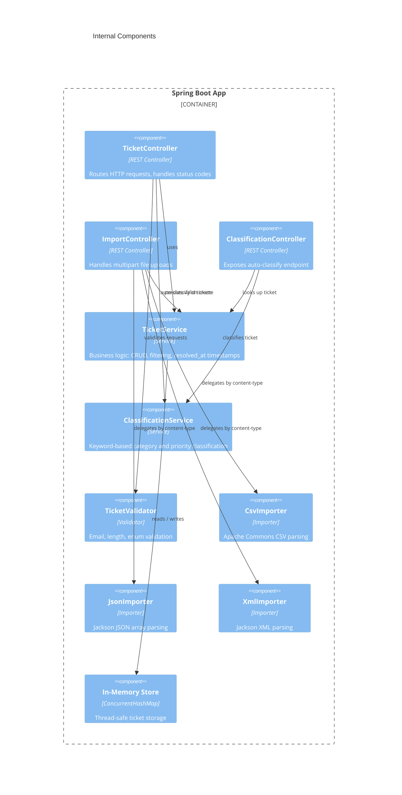
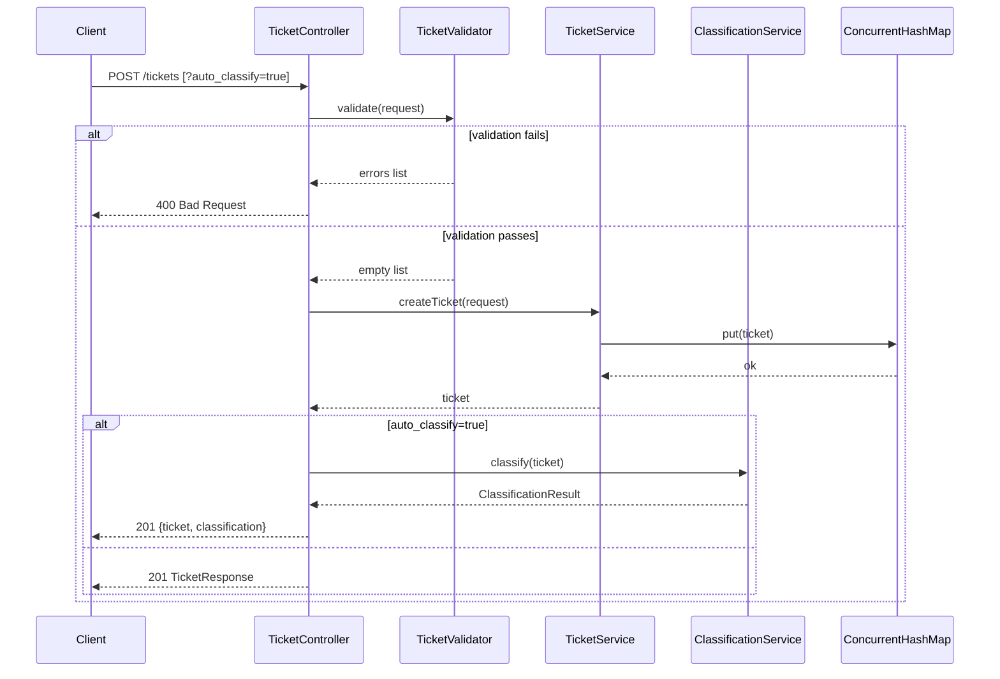
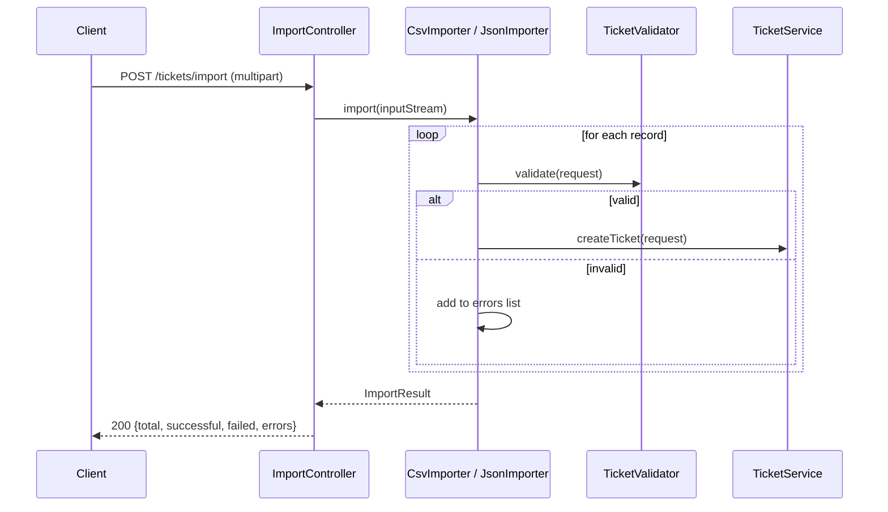

# Architecture — Customer Support Ticket System

## High-Level Overview

## Component Diagram

## Request Flow — Create Ticket

## Request Flow — Bulk Import

## Key Design Decisions

| Decision | Choice | Rationale |
|----------|--------|-----------|
| Storage | `ConcurrentHashMap` | Zero dependencies, thread-safe, sufficient for demo scope |
| Import routing | Content-Type header | Standard HTTP convention; avoids filename-based guessing |
| Classification | Keyword matching | Simple, deterministic, fully testable without LLM dependency |
| Enum serialization | Jackson `@JsonProperty` with lowercase values | REST convention; Spring `@JsonValue` drives consistent deserialization |
| ID generation | `UUID.randomUUID()` | Globally unique, no coordination needed |
| `resolved_at` | Auto-set on status → RESOLVED | Business invariant enforced in service layer, not controller |

## Trade-offs and Limitations

- **No persistence** — data is lost on restart; replace `ConcurrentHashMap` with JPA + PostgreSQL for production
- **XML coverage gap** — Jackson XML + Gradle 8.x compatibility limits XML importer test coverage to ~10%; CSV and JSON are fully tested
- **Enum query params** — Spring cannot deserialize lowercase enum values from `@RequestParam` without a custom converter; filter endpoints accept `null` for enum params
- **Classification** — purely keyword-based; no ML model; confidence score is proportional to keyword match count, not probabilistic

## Security Considerations

- No authentication — add Spring Security + JWT for production
- Input validation at controller boundary prevents injection via description/subject fields
- In-memory storage has no encryption at rest
- Rate limiting not implemented — required for public-facing deployments
