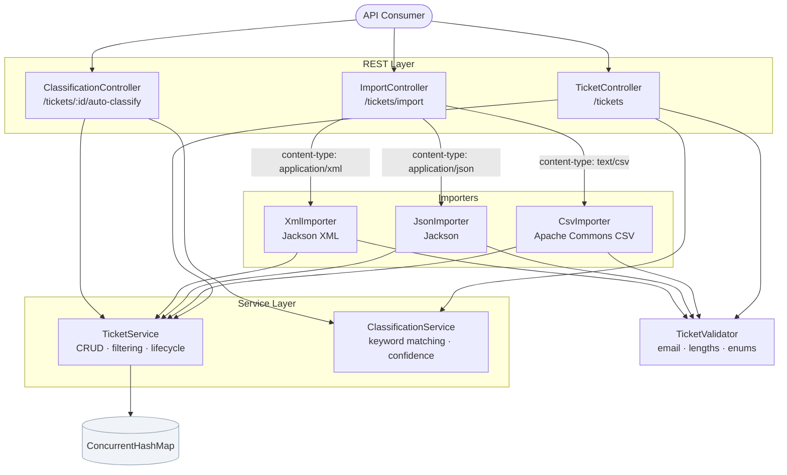
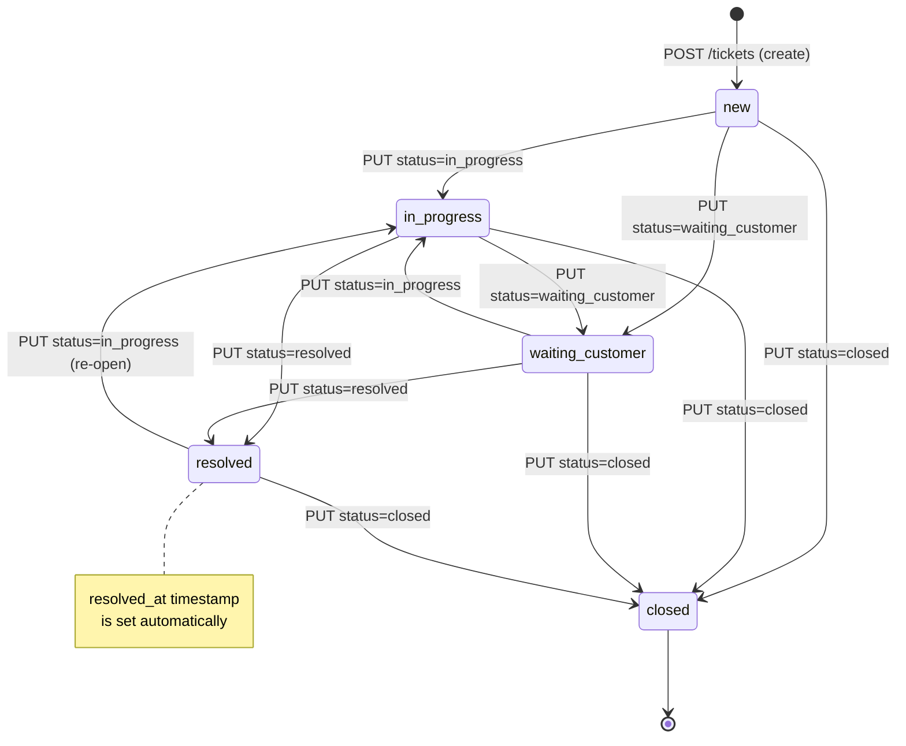
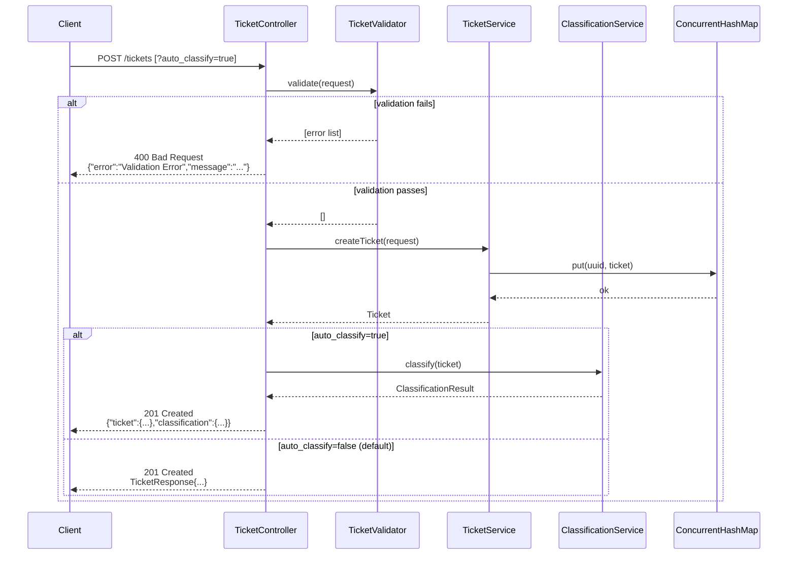
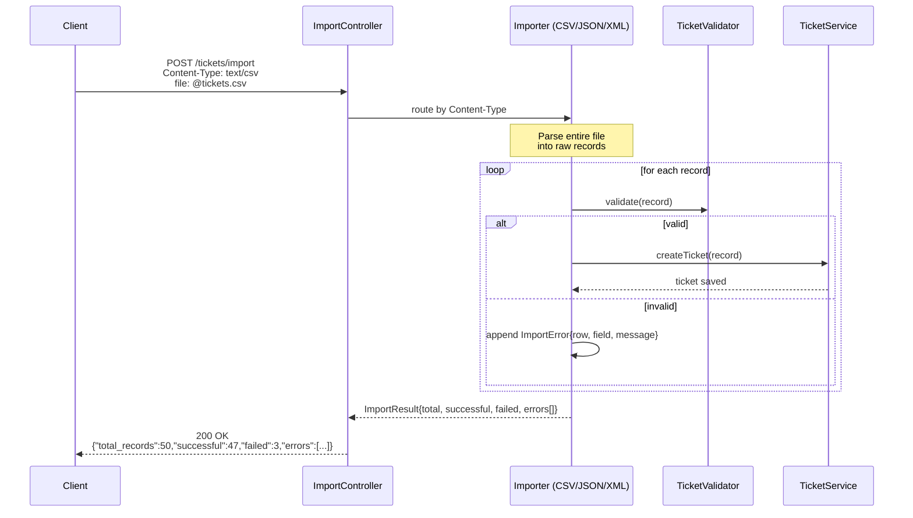
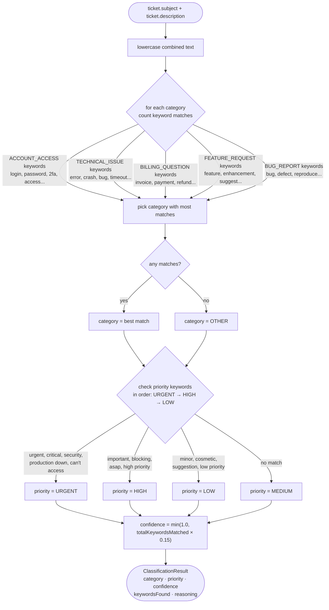
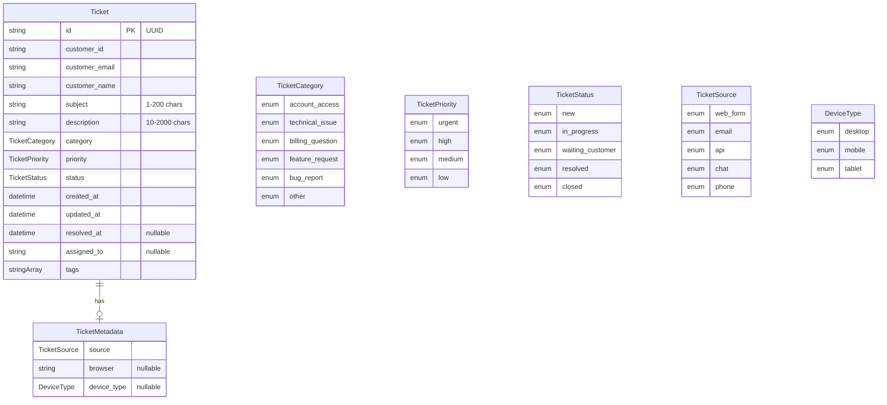
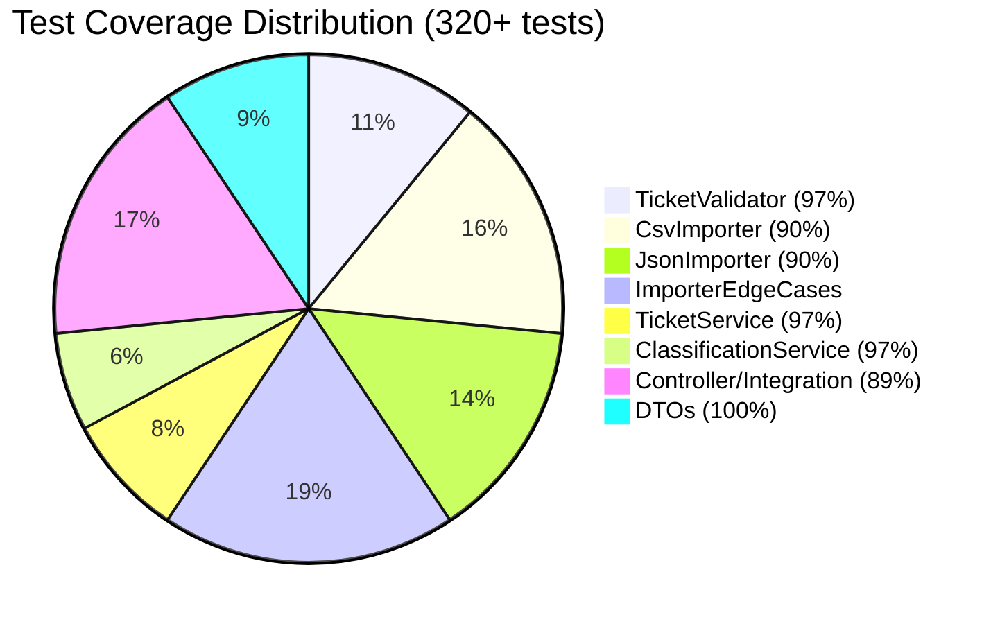

# System Diagrams — Customer Support Ticket System

All diagrams use [Mermaid](https://mermaid.js.org/) syntax. Render in GitHub, GitLab, or any Mermaid-compatible viewer.

---

## 1. Component Architecture

Shows how the main building blocks connect.

---

## 2. Ticket Lifecycle (State Machine)

---

## 3. Create Ticket — Request Flow

---

## 4. Bulk Import — Request Flow

---

## 5. Auto-Classification Logic

---

## 6. Data Model

---

## 7. Test Coverage by Layer

