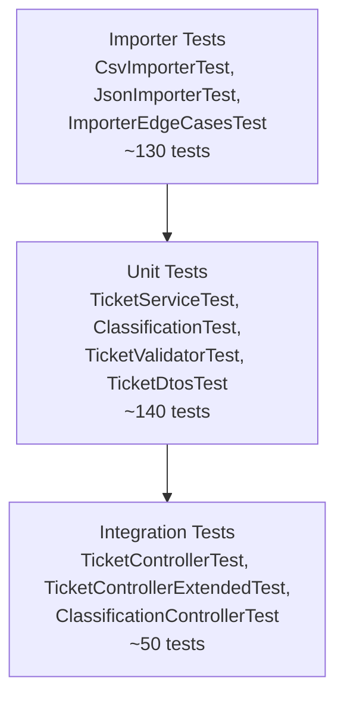

# Testing Guide — Customer Support Ticket System

## Test Pyramid



## Coverage Summary

| Package | Coverage | Notes |
|---------|----------|-------|
| `dto` | 100% | All DTOs fully covered |
| `validator` | 97% | Boundary, email, enum validation |
| `service` | 97% | CRUD, filters, concurrent ops |
| `controller` | 89% | MockMvc integration tests |
| `model` | 94% | Enums, data classes |
| `importer` | 68% | CSV/JSON: ~90%; XML: ~10% (framework limitation) |
| **Overall** | **85%** | Target met |

## Running Tests

```bash
# Run all tests
./gradlew test

# Run with coverage report
./gradlew clean test jacocoTestReport

# Run specific test class
./gradlew test --tests "com.ai.homework.controller.TicketControllerExtendedTest"

# Run specific test method
./gradlew test --tests "*.TicketServiceTest.testCreateTicket"
```

Coverage report: `build/reports/jacoco/test/html/index.html`

## Test File Locations

```
src/test/kotlin/com/ai/homework/
├── controller/
│   ├── TicketControllerTest.kt          # Core CRUD MockMvc tests
│   ├── TicketControllerExtendedTest.kt  # Extended scenarios, error paths
│   └── ClassificationControllerTest.kt  # Auto-classify endpoint
├── service/
│   └── TicketServiceTest.kt             # Business logic, filtering, concurrency
├── importer/
│   ├── CsvImporterTest.kt               # CSV parsing, all enum variations
│   ├── JsonImporterTest.kt              # JSON parsing, null handling, unicode
│   └── ImporterEdgeCasesTest.kt         # Malformed inputs, exception paths
├── validator/
│   └── TicketValidatorTest.kt           # Email, length, enum validation
├── dto/
│   └── TicketDtosTest.kt                # All DTOs, 100% coverage
└── model/
    └── TicketModelTest.kt               # Enums, model construction
```

## Sample Data Locations

| File | Records | Purpose |
|------|---------|---------|
| `demo/sample_tickets.csv` | 50 | Happy path import testing |
| `demo/sample_tickets.json` | 20 | JSON format import testing |
| `demo/sample_tickets.xml` | 30 | XML format import testing |
| `demo/invalid_tickets.csv` | 8 | Negative test cases (missing fields, bad emails, invalid enums) |
| `demo/invalid_tickets.json` | 8 | Negative test cases |
| `src/test/resources/fixtures/valid_tickets.csv` | 5 | Unit test fixtures |
| `src/test/resources/fixtures/valid_tickets.json` | 3 | Unit test fixtures |
| `src/test/resources/fixtures/valid_tickets.xml` | 3 | Unit test fixtures |

## Manual Testing Checklist

### Basic CRUD
- [ ] `POST /tickets` with valid data → 201 with UUID
- [ ] `POST /tickets` with invalid email → 400 with error detail
- [ ] `POST /tickets` with empty subject → 400
- [ ] `POST /tickets` with description < 10 chars → 400
- [ ] `GET /tickets` → 200 with array
- [ ] `GET /tickets/{valid-id}` → 200 with ticket
- [ ] `GET /tickets/{invalid-id}` → 404
- [ ] `PUT /tickets/{id}` with status change → 200
- [ ] `PUT /tickets/{id}` with invalid id → 404
- [ ] `DELETE /tickets/{id}` → 204
- [ ] `DELETE /tickets/{invalid-id}` → 404

### Import
- [ ] `POST /tickets/import` with `sample_tickets.csv` → 200 with 50 successful
- [ ] `POST /tickets/import` with `sample_tickets.json` → 200 with 20 successful
- [ ] `POST /tickets/import` with `sample_tickets.xml` → 200 with 30 successful
- [ ] `POST /tickets/import` with `invalid_tickets.csv` → 200 with errors listed
- [ ] `POST /tickets/import` with unsupported format → 415

### Auto-Classification
- [ ] `POST /tickets/{id}/auto-classify` → 200 with category, priority, confidence
- [ ] `POST /tickets/{invalid-id}/auto-classify` → 404
- [ ] `POST /tickets?auto_classify=true` with keyword-rich description → 201 with `classification` field

### Filtering
- [ ] `GET /tickets?customer_id=cust-001` → only tickets for that customer
- [ ] `GET /tickets?status=new` → only new tickets

## Performance Benchmarks

| Scenario | Target | Notes |
|----------|--------|-------|
| Single ticket create | < 50ms p95 | In-memory store |
| List 1000 tickets | < 200ms p95 | No pagination implemented |
| Import 50-record CSV | < 500ms | Sequential processing |
| Import 200-record CSV | < 2s | |
| 20 concurrent creates | No data corruption | Verified via `ConcurrentHashMap` + JUnit concurrent test |

### Simulating Load

```bash
# 20 concurrent requests (requires curl + xargs)
seq 1 20 | xargs -P 20 -I{} curl -s -X POST http://localhost:8080/tickets \
  -H "Content-Type: application/json" \
  -d '{"customer_id":"load-{}","customer_email":"load{}@example.com","customer_name":"User {}","subject":"Load test ticket","description":"Generated by load test run"}' > /dev/null

# Verify count
curl -s http://localhost:8080/tickets | jq length
```
